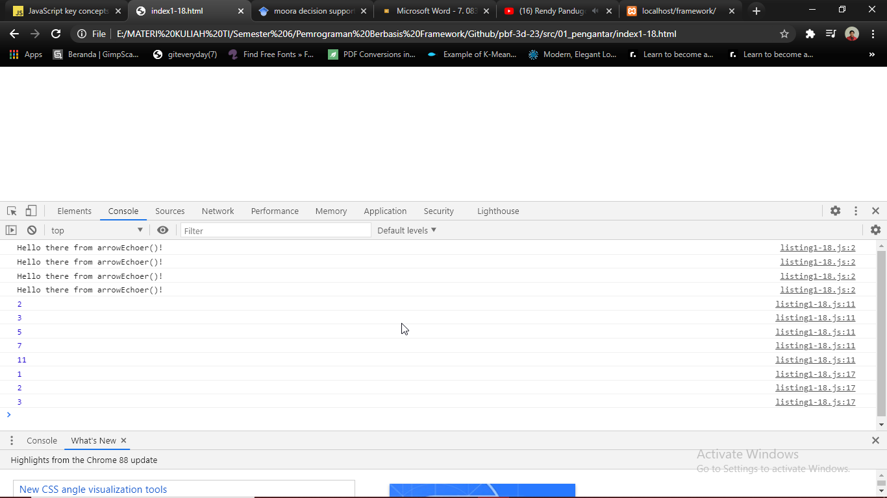

# 01 - Pengantar

## Tujuan Pembelajaran

1. Mampu memahami dan implementasi penggunaan scope pada JavaScript
2. Mampu memahami dan implementasi penggunaan variabel pada JavaScript
3. Memahami perbedaan let dan const pada JavaScript
4. Memahami export dan import pada JavaScript
5. Memahami macam-macam function JavaScript

## Hasil Praktikum

- Link kode program listing 1-1 : 
  [Listing 1-1](../../src/01_pengantar/listing1-1.js)

- Link kode program listing 1-2
  [Listing 1-2](../../src/01_pengantar/listing1-2.js)

- Link kode program listing 1-3
  [Listing 1-3](../../src/01_pengantar/listing1-3.js)

- Link kode program listing 1-4
  [Listing 1-4](../../src/01_pengantar/listing1-4.js)

- Link kode program listing 1-5
  [Listing 1-5](../../src/01_pengantar/listing1-5.js)

- Link kode program listing 1-6
  [Listing 1-6](../../src/01_pengantar/listing1-6.js)

- Link kode program listing 1-7
  [Listing 1-7](../../src/01_pengantar/listing1-7.js)

- Link kode program listing 1-8
  [Listing 1-8](../../src/01_pengantar/listing1-8.js)

- Link kode program listing 1-9
  [Listing 1-9](../../src/01_pengantar/listing1-9.js)

- Link kode program listing 1-10
  [Listing 1-10](../../src/01_pengantar/listing1-10.js)

- Link kode program listing 1-11
  [Listing 1-11](../../src/01_pengantar/listing1-11.js)

- Link kode program listing 1-12
  [Listing 1-12](../../src/01_pengantar/listing1-12.js)

- Link kode program listing 1-13
  [Listing 1-13](../../src/01_pengantar/listing1-13.js)

Listing 1-14 berhasil :

Listing 1-14 gagal :

- Link kode program listing 1-14
  [Listing 1-14](../../src/01_pengantar/listing1-14.js)

Listing 1-15 const :

Listing 1-15 let :

- Link kode program listing 1-15
  [Listing 1-15](../../src/01_pengantar/listing1-15.js)

- Link kode program listing 1-16
  [Listing 1-16](../../src/01_pengantar/listing1-16.js)

- Link kode program listing 1-17
  [Listing 1-17](../../src/01_pengantar/listing1-17.js)

- Link kode program listing 1-18
  [Listing 1-18](../../src/01_pengantar/listing1-18.js)

- Link kode program listing 1-19
  [Listing 1-19](../../src/01_pengantar/listing1-19.js)

- Link kode program listing 1-20
  [Listing 1-20](../../src/01_pengantar/listing1-20.js)

- Link kode program listing 1-21
  [Listing 1-21](../../src/01_pengantar/listing1-21.js)

- Link kode program listing 1-22
  [Listing 1-22](../../src/01_pengantar/listing1-22.js)