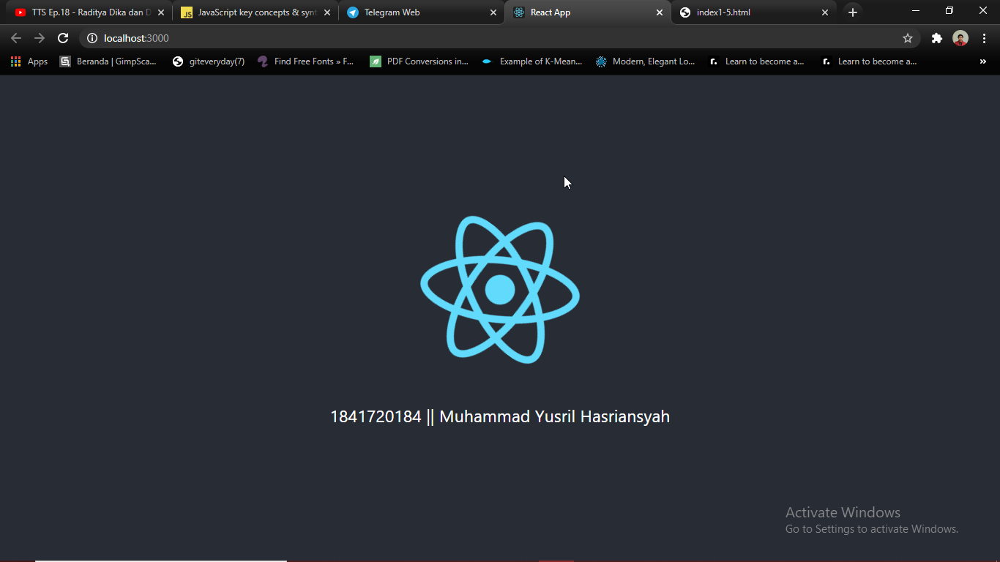

# 02 - Layout

## Tujuan Pembelajaran

1. Mampu memahami dan mengimplementasikan ReactJS
2. Belajar membuat website menggunakan ReactJS

## Hasil Praktikum

Hasil create react app ( menampilkan NIM | NAMA) :

