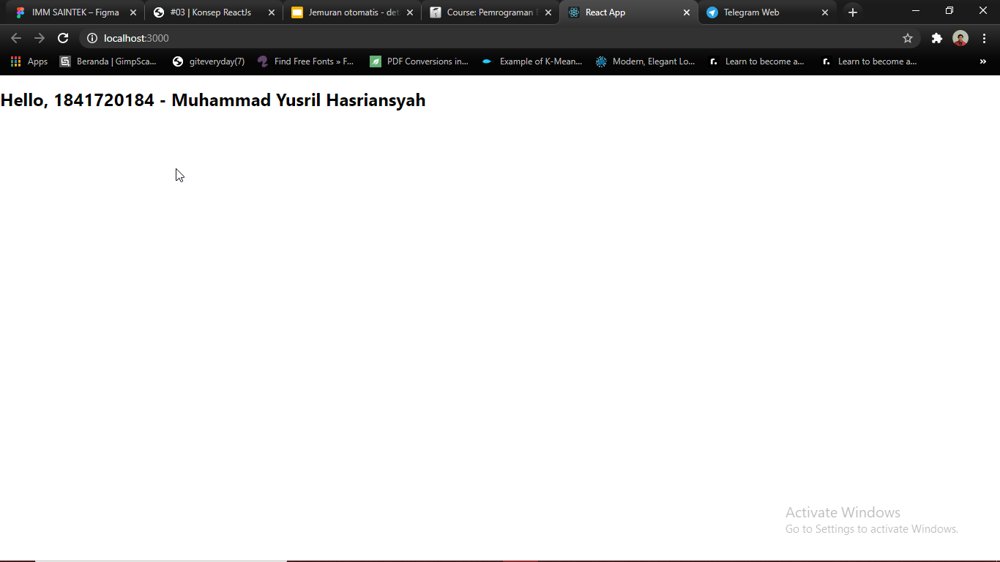
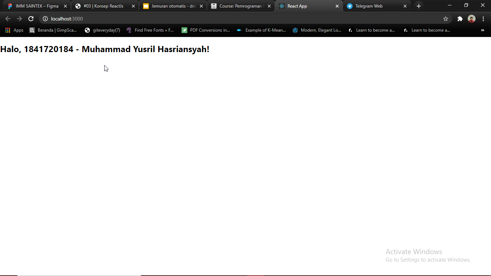
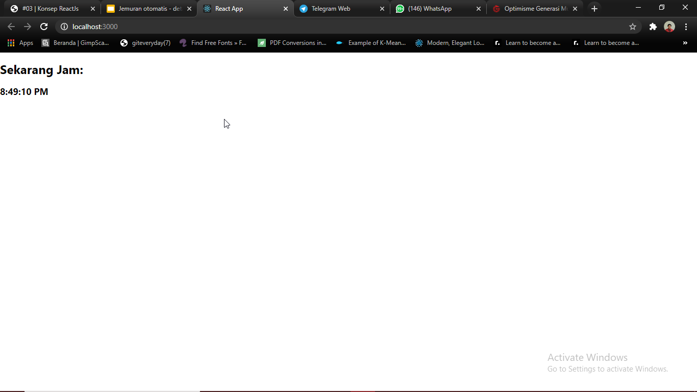
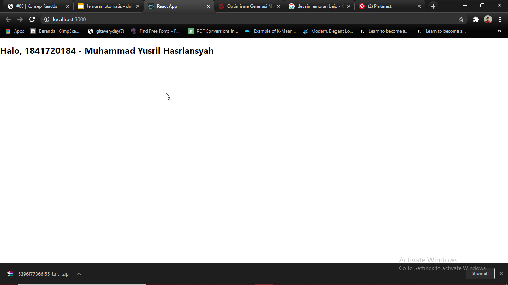
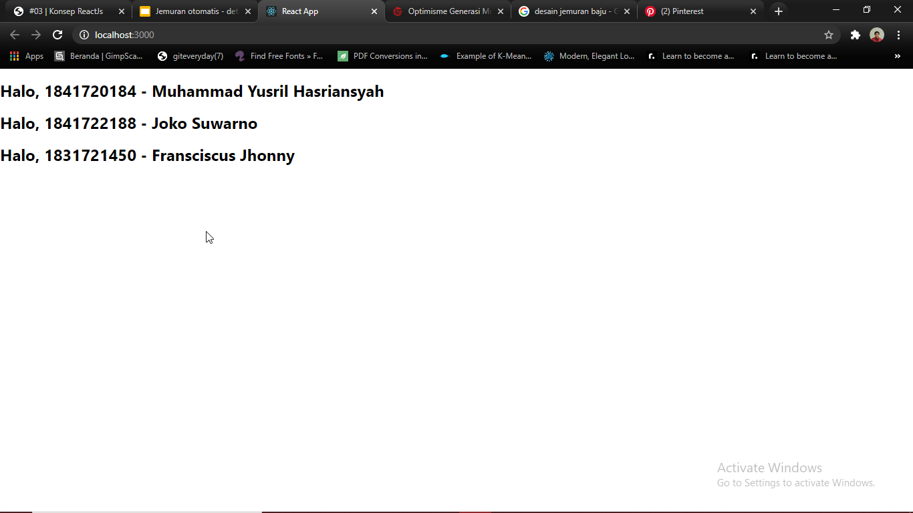
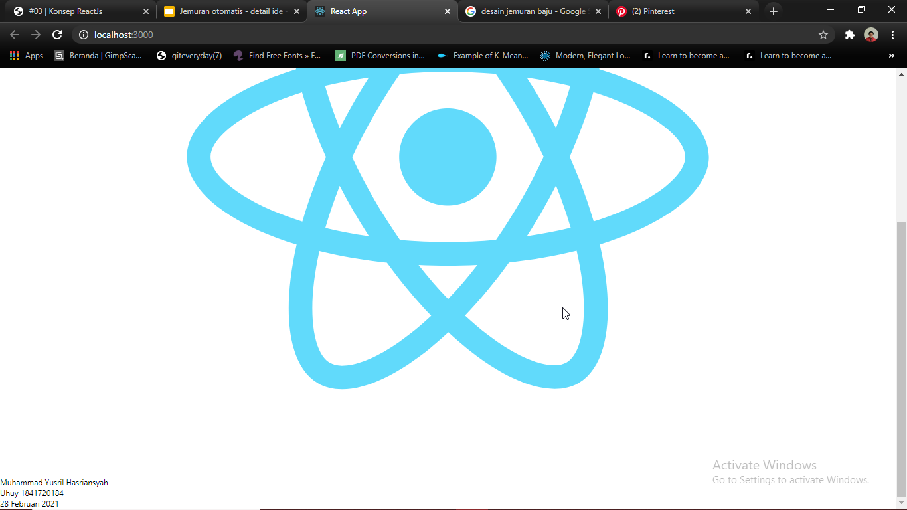
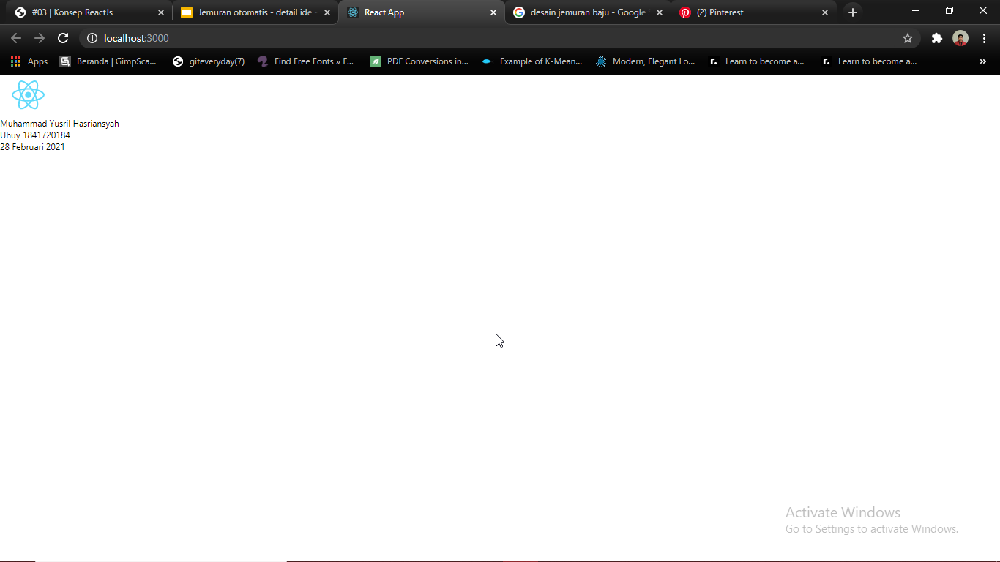
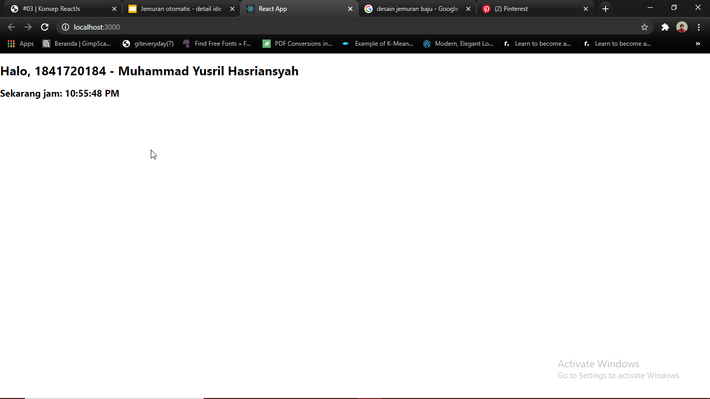

# 03 - Konsep ReactJS

## Tujuan Pembelajaran

1. Mampu memahami konsep dasar ReactJS
2. Belajar dasar-dasar dari ReactJS

## Hasil Praktikum

Screenshot

* Praktikum 1-1
 

* Praktikum 1-2
 

* Praktikum 2
 

* Praktikum 3
 

* Praktikum 4
 

* Praktikum 5-1
 

* Praktikum 5-2
 

* Praktikum 6-1
 

* Praktikum 6-2
 