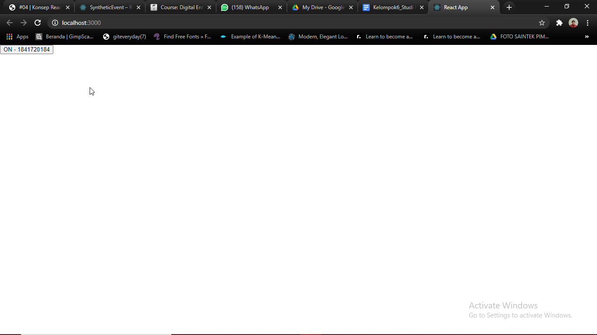
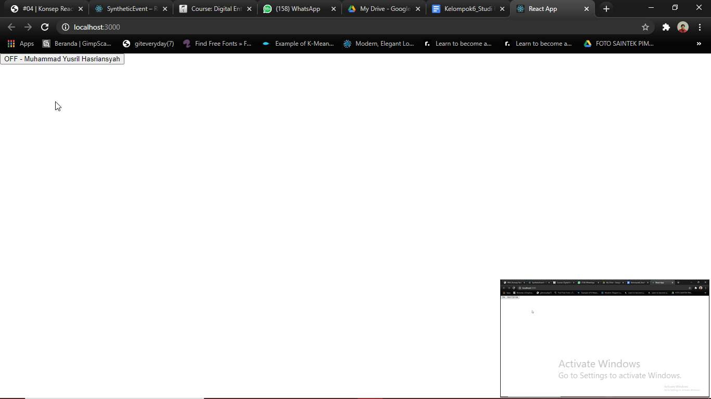
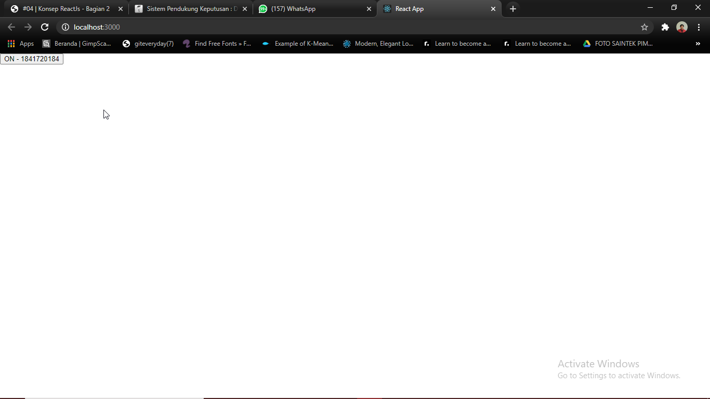
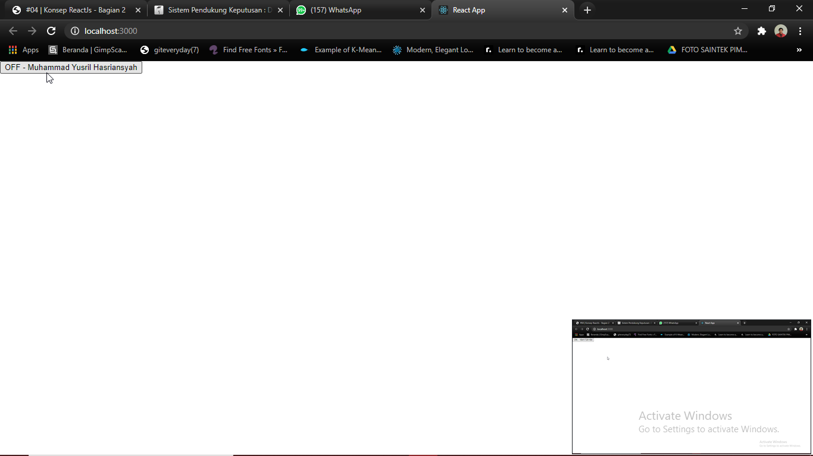
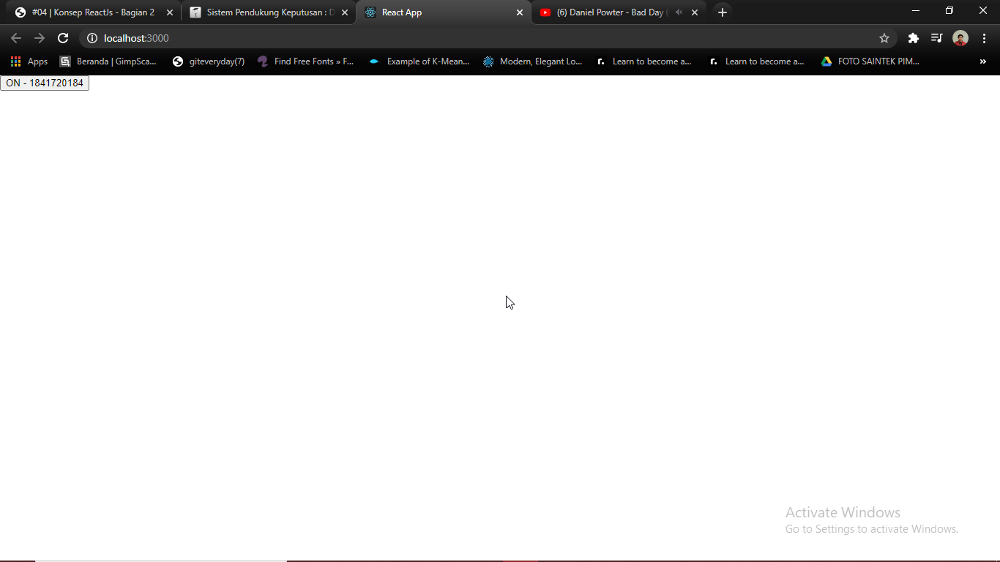
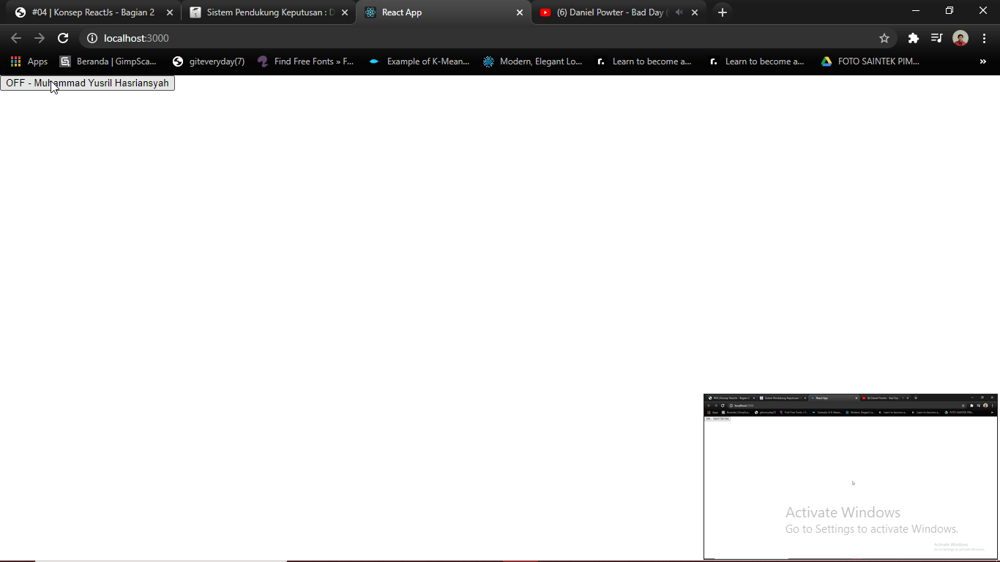
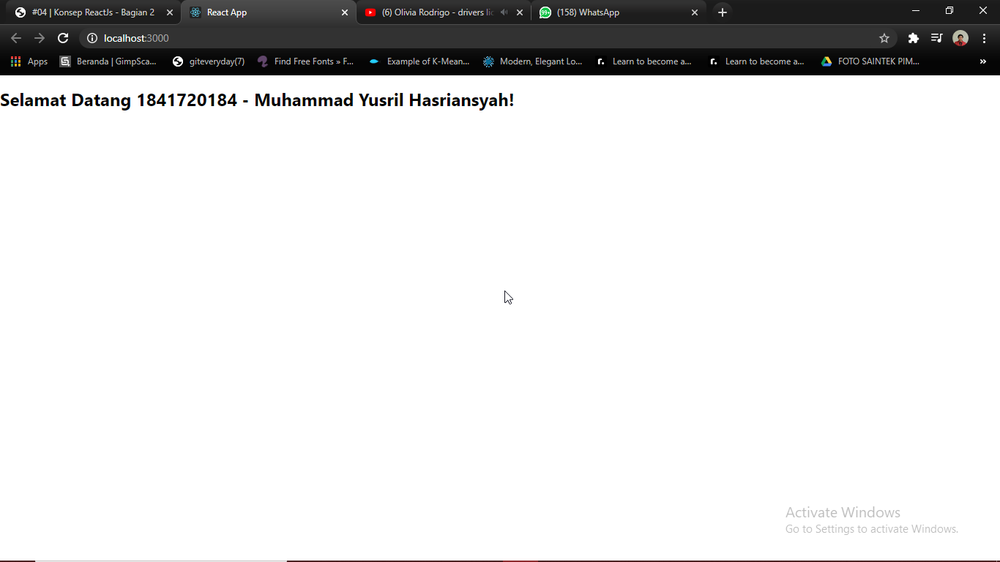

# 04 - Konsep ReactJS Bagian 2

## Tujuan Pembelajaran

1. Mampu memahami dan mengimplementasikan ReactJS
2. Belajar membuat website menggunakan ReactJS
3. Mampu memahami dan menerapkan cara menangani event
4. Mampu melakukan rendering secara kondisional
5. Mampu memahami dan menerapkan penggunaan Lists dan Keys
6. Mampu memahami dan menerapkan penggunaan Forms

## Hasil Praktikum

* Praktikum 1 (Events) :
    1. Cara 1 :
    
    ON
     
    OFF
     

    2. Cara 2 :
    
    ON
     
    OFF
     
    
    3. Cara 3 :
    
    ON
     
    OFF
     
    

* Praktikum 2 (Conditional Rendering) :
    1. Login
        
    2. Logout

* Praktikum 2 () :
 

* Praktikum 3 () :
 

* Praktikum 4 () :
 

* Praktikum 5-1 () :
 

* Praktikum 5-2 () :
 

* Praktikum 6-1 () :
 

* Praktikum 6-2 () :
 