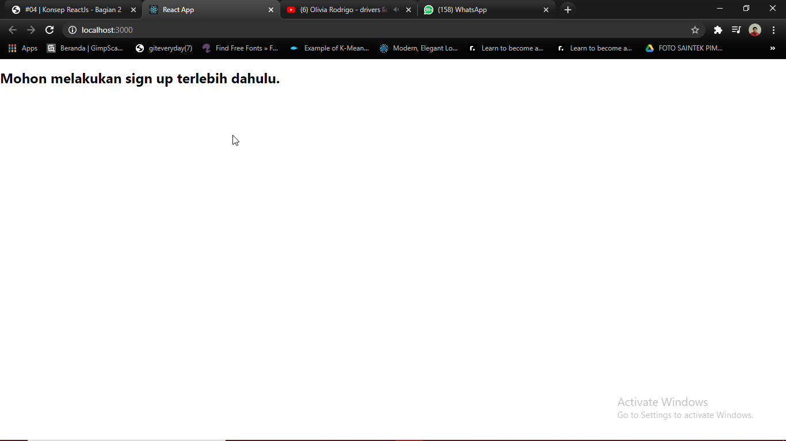
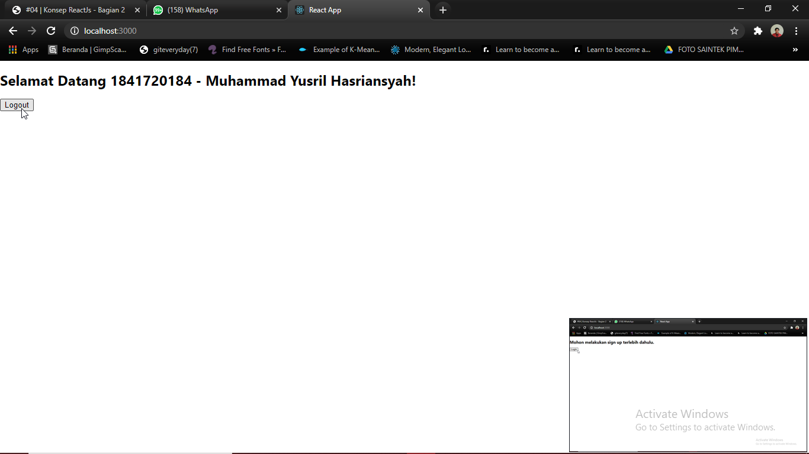
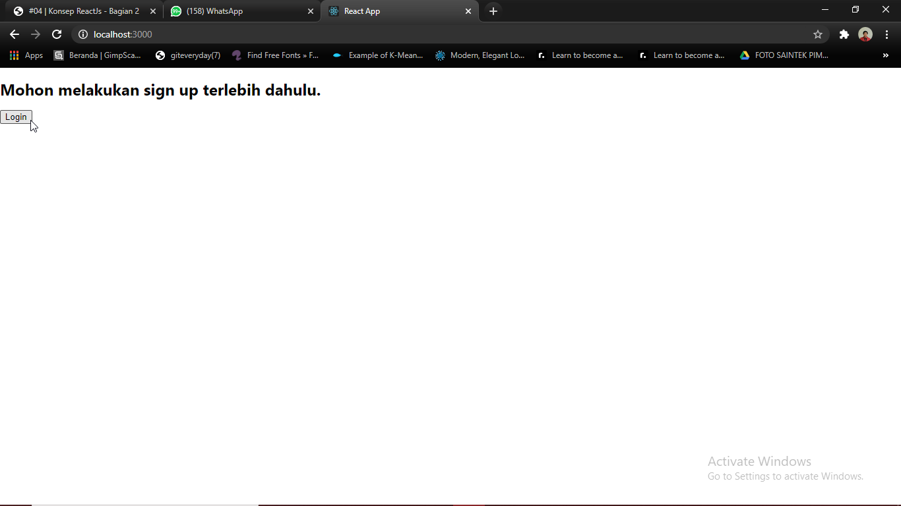
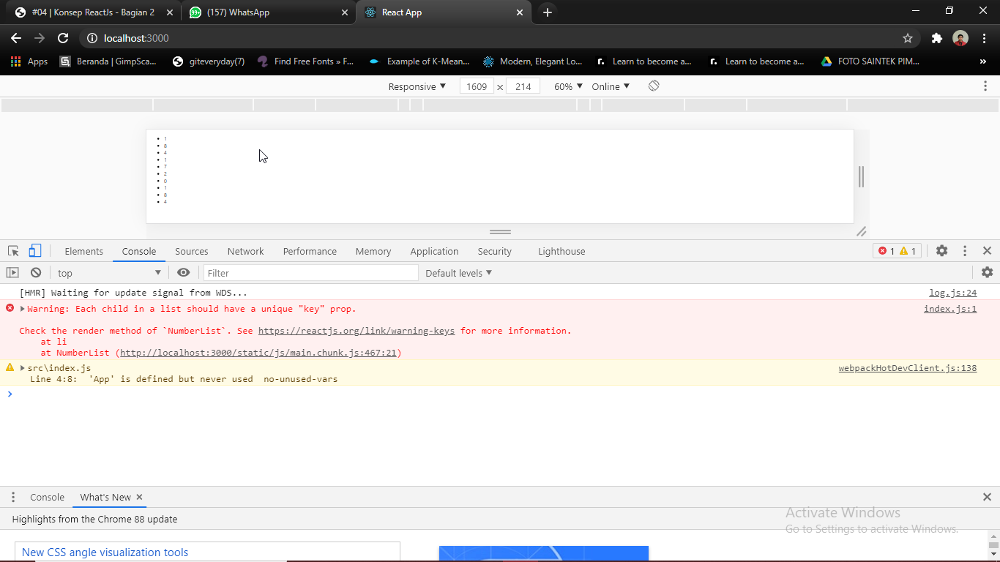
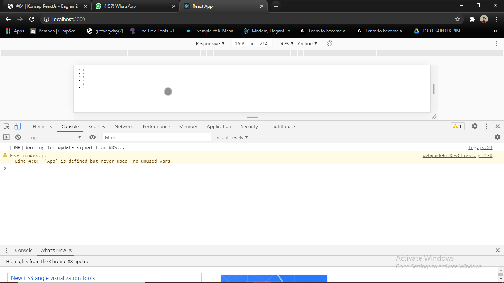
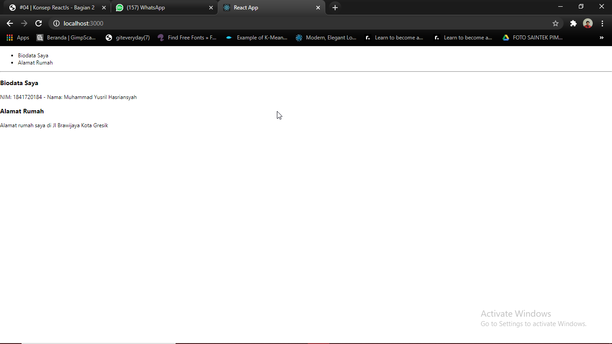
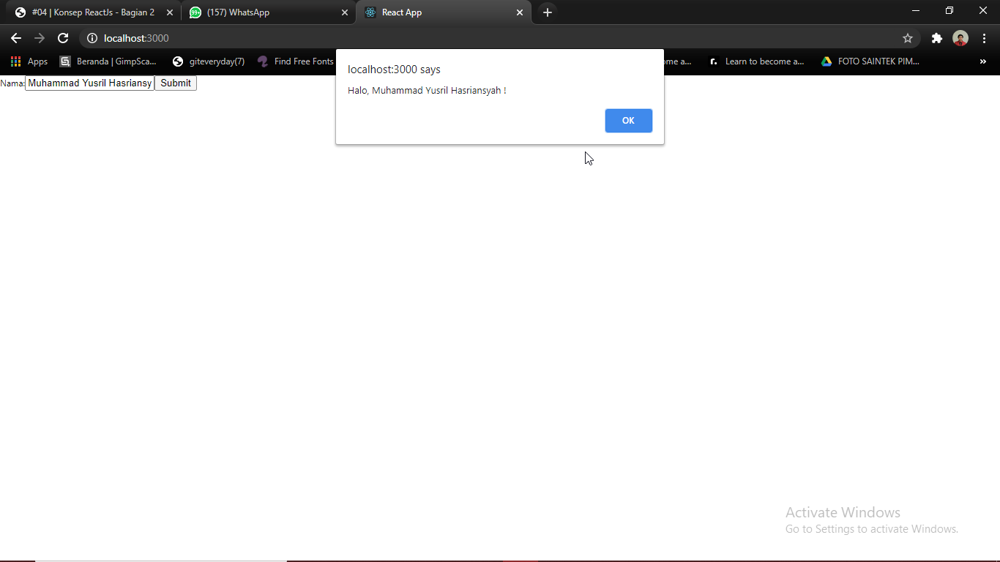
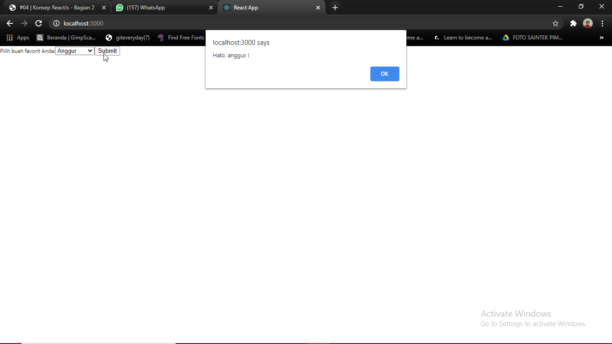
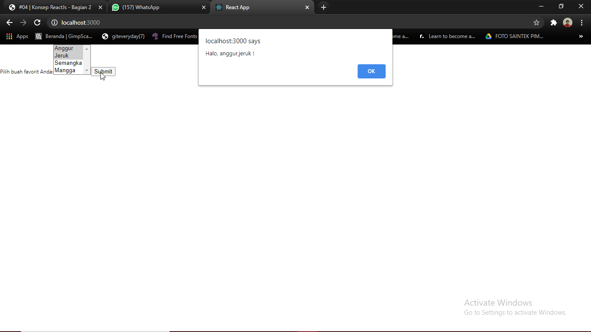

# 04 - Konsep ReactJS Bagian 2

## Tujuan Pembelajaran

1. Mampu memahami dan mengimplementasikan ReactJS
2. Belajar membuat website menggunakan ReactJS
3. Mampu memahami dan menerapkan cara menangani event
4. Mampu melakukan rendering secara kondisional
5. Mampu memahami dan menerapkan penggunaan Lists dan Keys
6. Mampu memahami dan menerapkan penggunaan Forms

## Hasil Praktikum

* Praktikum 1 (Events) :
    1. Cara 1 :
    
    ON
     
    OFF
     

    2. Cara 2 :
    
    ON
     
    OFF
     
    
    3. Cara 3 :
    
    ON
     
    OFF
     
    

* Praktikum 2 (Rendering login secara kondisional) :
    1. Login
        
    2. Logout
        

* Praktikum 3 (Menyimpan elements dengan variabel) :
    1. Login
        
    2. Logout
        

* Praktikum 4 (Komponen list dasar) :
    - List sebelum diberikan key
        
    - List setelah diberikan key
        

* Praktikum 5 (Membuat unique keys) :
 

* Praktikum 6 (Membuat form dengan controlled components) :
    - Form :
     
    - Text Area :
     
    - Select :
     
    - Multiple Select :
     