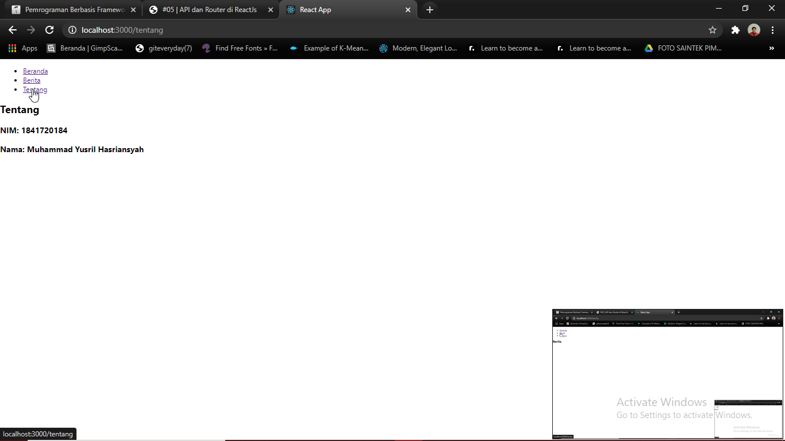

# 05 - API Router ReactJS

## Tujuan Pembelajaran

1. Mampu memahami dan mengimplementasikan API menggunakan ReactJS
2. Mampu memahami dan mengimplementasikan routing pada ReactJS
3. 

## Hasil Praktikum

### Praktikum 1

### Praktikum 2

### Praktikum 3

## Tugas

