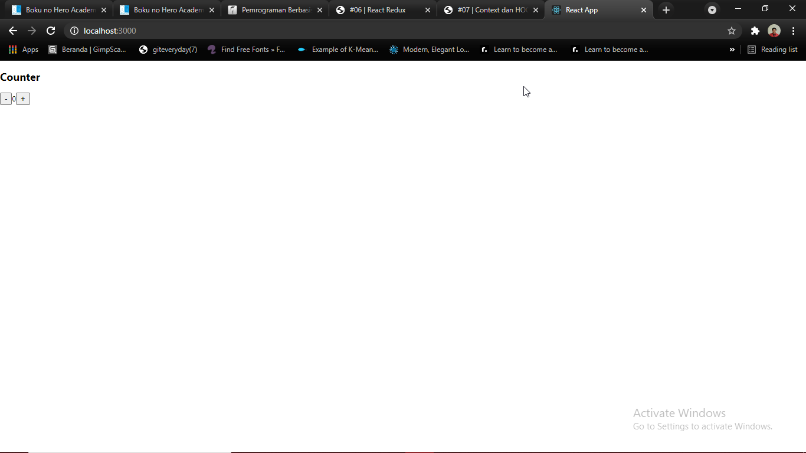
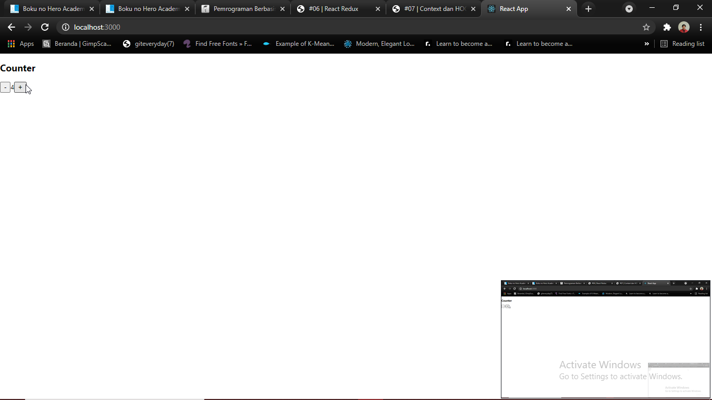
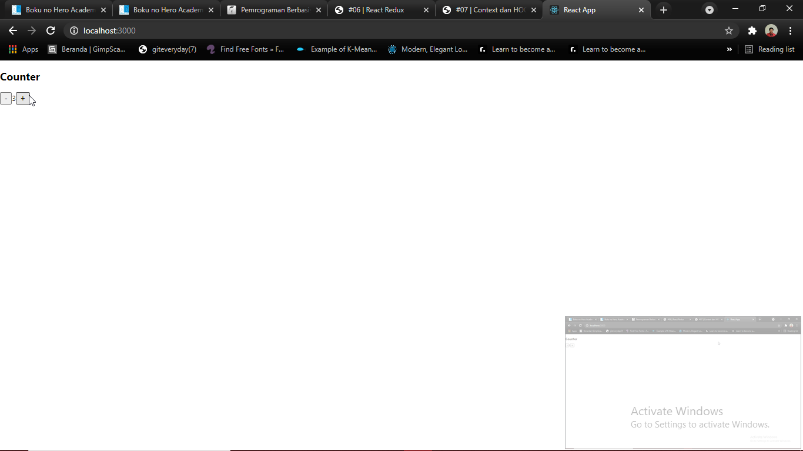
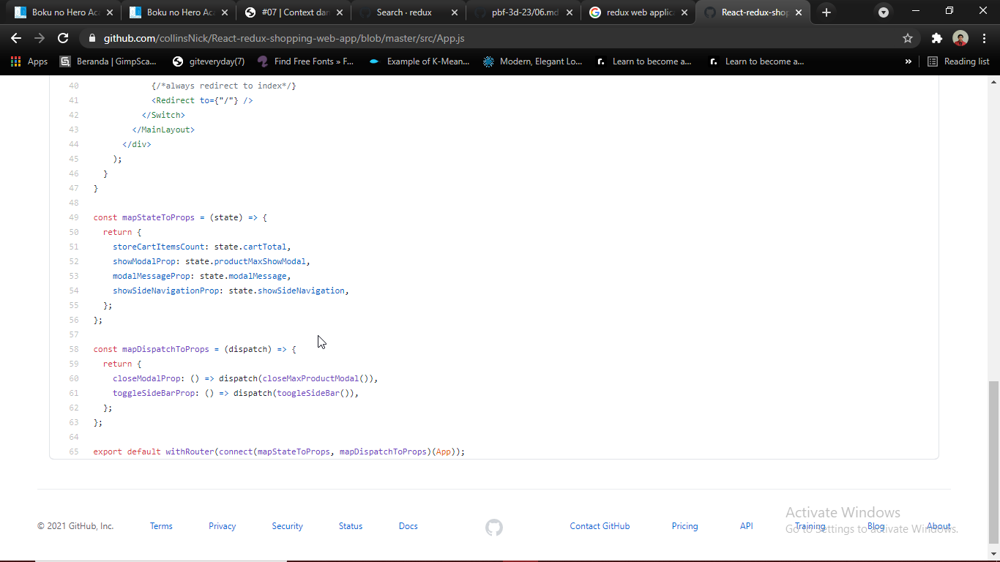

# 06 - Redux React

## Tujuan Pembelajaran

1. Mampu memahami dan mengimplementasikan Redux pada ReactJS
2. Mampu menerapkan konsep Redux pada project

## Hasil Praktikum

### Screenshot :

- Kondisi Awal :

- Increment :

- Decrement :

### Tugas

1. Jelaskan maksud sintaks `this.props.dispatch` pada praktikum langkah 16 sebelumnya!
2. Jelaskan maksud istilah yang ada dalam Redux berikut ini:

- Actions
- Reducers
- Action creators
- Middleware
- Pure functions
- Immutability

3. Jelaskan maksud sintaks `export default connect(mapStateToProps)(Counter)` pada praktikum langkah 9 sebelumnya!

4. Carilah sebuah studi kasus aplikasi yang cukup kompleks di GitHub yang memanfaatkan Redux! Kemudian screenshot bagian kode program mana yang merupakan proses Redux dan jelaskan prosesnya! (cantumkan link repository GitHub yang Anda temukan)

### Jawaban :
1. `this.props.dispatch` berfungsi untuk mengirimkan sebuah _action_. [connect-mapdispatch](https://react-redux.js.org/using-react-redux/connect-mapdispatch)

2. 

3. mapStateToProps digunakan untuk memilih bagian data dari penyimpanan yang dibutuhkan komponen yang terhubung.[connect-mapstate](https://react-redux.js.org/using-react-redux/connect-mapstate)

4. 

Source : [React-redux-shopping-web-ap](https://github.com/collinsNick/React-redux-shopping-web-app/)