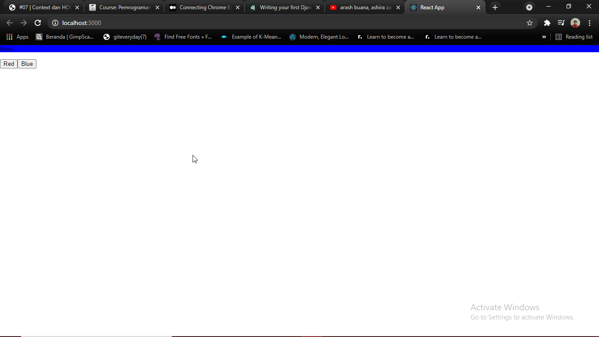

# 07 - Context dan HOC

## Tujuan Pembelajaran

1. Mampu memahami konsep Context pada ReactJS
2. Mampu mengimplementasikan Context sesuai kebutuhan
3. Mampu memahami HOC (High Order Component)

## Hasil Praktikum

### Screenshot :
1. Theme Merah (Red) : 

2. Theme Biru (Blue) : 

