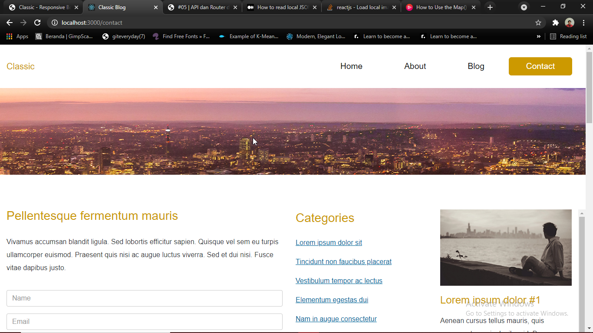
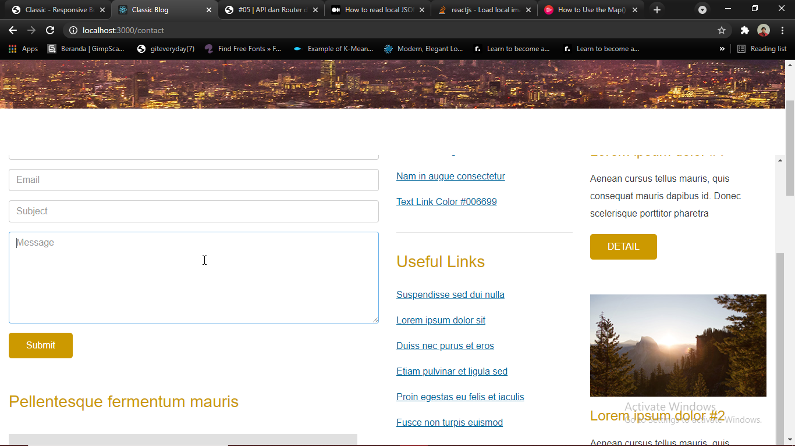

# 08 - UTS

## Hasil UTS

1. Tampilan Homepage :
    - 
    - 
    - 

2. Tampilan About :
    - 
    - 
    - 

3. Tampilan Blog :
    - 
    - 
    - 

4. Tampilan Contact :
    - 
    - 
    - 

Footer : 

Website sudah diubah menjadi Single Page Application (SPA) memanfaatkan Routing ReactJS. Begitu juga dengan HOC.

- Routing :

- HOC :

## Pernyataan Diri

Saya menyatakan isi tugas, kode program, dan laporan praktikum ini dibuat oleh saya sendiri. Saya tidak melakukan plagiasi, kecurangan, menyalin/menggandakan milik orang lain.

Jika saya melakukan plagiasi, kecurangan, atau melanggar hak kekayaan intelektual, saya siap untuk mendapat sanksi atau hukuman sesuai peraturan perundang-undangan yang berlaku.

Ttd,

***Muhammad Yusril Hasriansyah***
