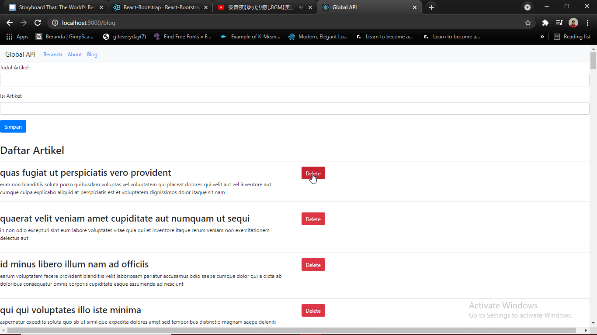

# 09 - Global API dan Hooks

## Tujuan Pembelajaran

1. Mampu memahami konsep Global API
2. Mampu mengimplementasikan API dalam satu environment global
3. Mampu memahami Hooks
4. Mampu mengimplementasikan Hooks dalam project

## Hasil Praktikum

1. Global API :
    > GET:
        
    

    > POST:
    
    *  
    
    
    *  
    
    
    *  
    
    
    > DELETE:

    *  
    
    
    *  
    
    
    *  
    

