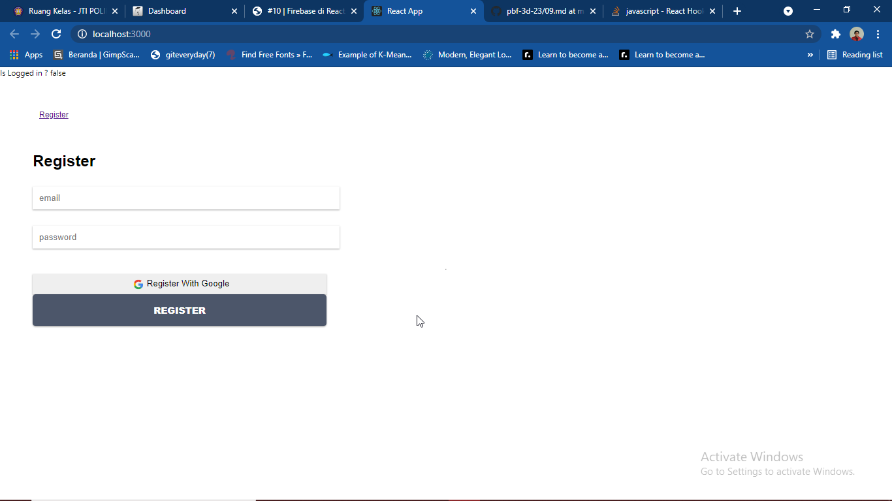
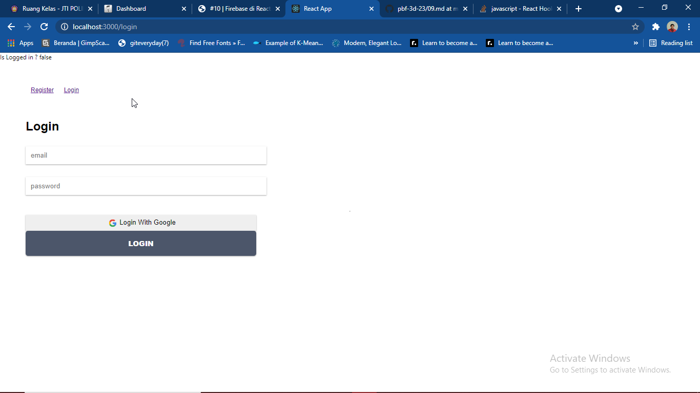
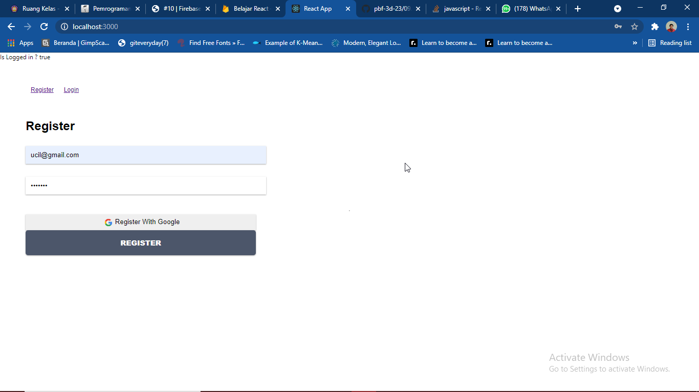
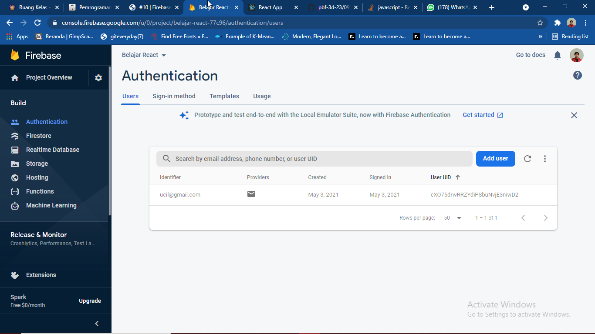
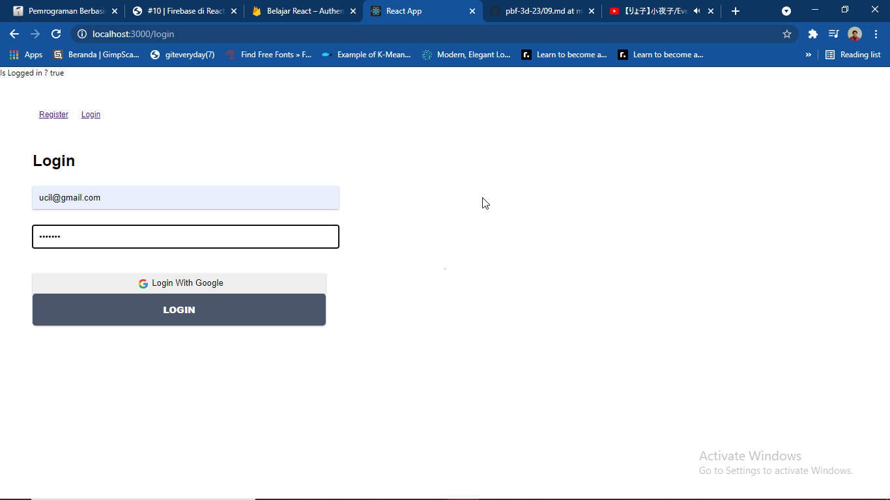
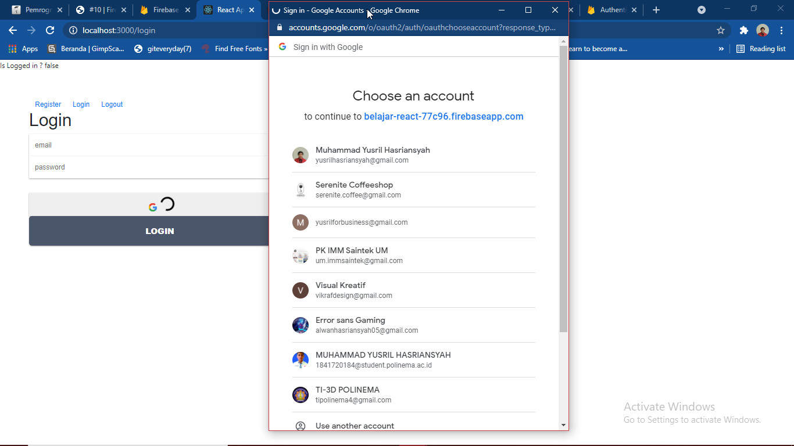
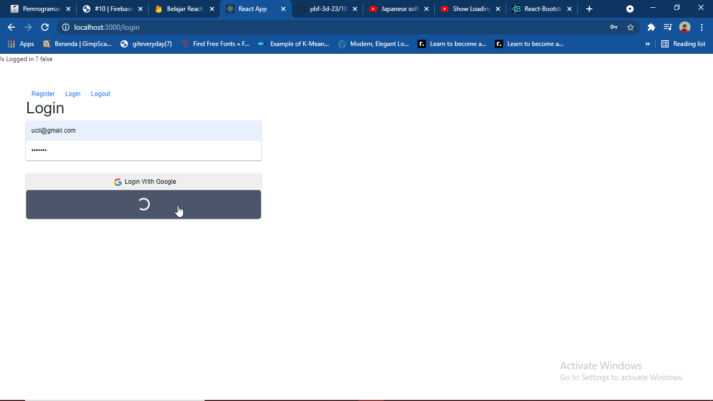

# 10 - Firebase

## Tujuan Pembelajaran

1. Mampu memahami konsep tentang firebase
2. Mampu mengimplementasikan firebase ke dalam project
3. Mampu mengelola project dalam firebase console

## Hasil Praktikum

1. Praktikum 1 (Membuat Form Register) :
    

2. Praktikum 2 (Membuat Form Login) :
    

3. Praktikum 3 (Koneksi ke Firebase) :
    - Register
    
    - Akun Terdaftar pada Firebase
    
    - Login
    

## Tugas

- Login With Google

- Animation
