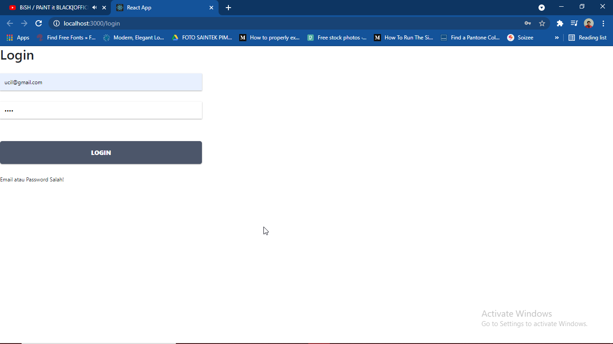
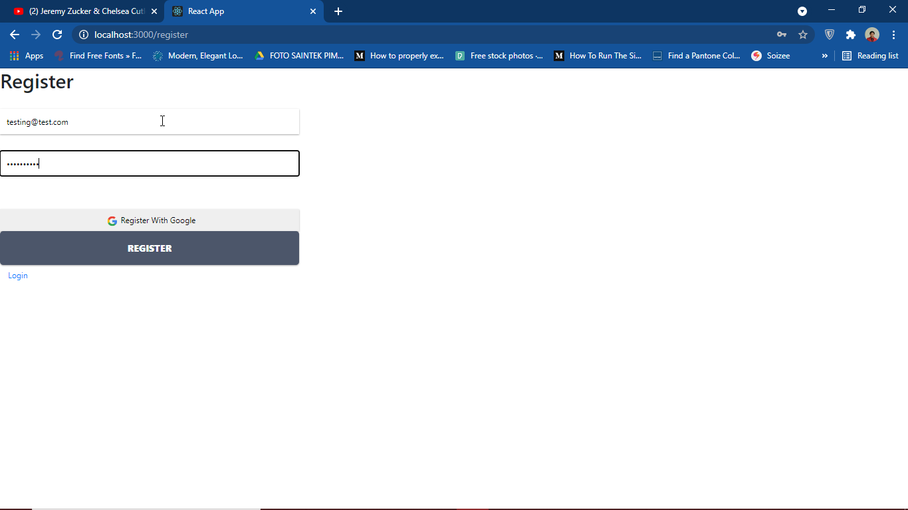
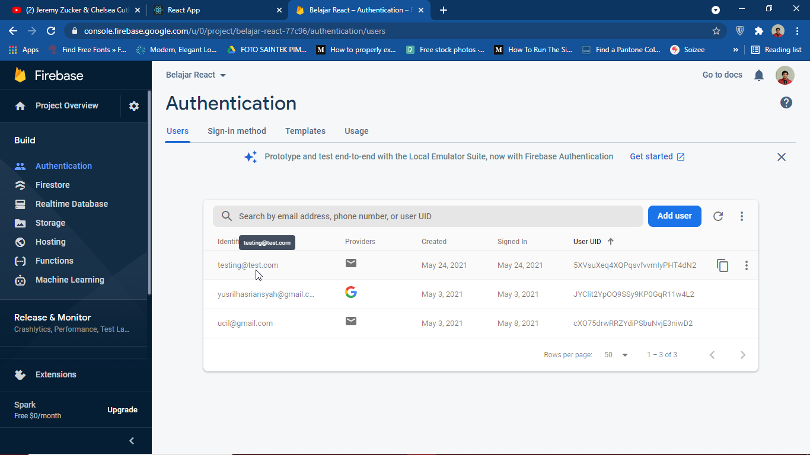

# 11 - Redux Thunk

## Tujuan Pembelajaran

1. Mampu memahami konsep tentang Redux Thunk
2. Mampu mengimplementasikan Redux Thunk ke dalam project
3. Mampu mengelola project dengan bantuan Redux Thunk

## Tugas

### Pertanyaan
1. Berdasarkan praktikum yang telah Anda lakukan, jelaskan perbedaan fitur yang ada dalam komponen Login dan Home! Mengapa komponen Login tidak menggunakan class seperti pada komponen Home ?
2. Jelaskan kegunaan dan alur logika dari protectedRoute.js !
3. Coba lakukan login dengan email atau password yang salah, apa yang terjadi? Jelaskan!
4. Jika Anda berada di halaman Home, coba akses form login tanpa melakukan logout. Apakah form login bisa diakses Jelaskan!
5. Tambahkan menu Register pada form login sehingga user yang belum terdaftar dapat melakukan registrasi! Jika registrasi sukses, maka user langsung diarahkan ke halaman Home.

### Jawaban
1. Perbedaannya adalah di bagian `isAuthenticated`. Pada halaman `Login` terdapat fitur `isAuthenticated` untuk melakukan pengecekan terhadap user, apakah sudah login atau belum. Sedangkan di halaman `Home` tidak ada. Karena pada bagian login memanfaatkan fitur `useState`, dimana dia tidak akan bisa dipanggil jika menggunakan class.
2. 
    -  Kegunaan `protectedRoute.js` adalah untuk melakukan pencegahan berpindahnya halaman sebelum login atau logout berhasil dilakukan. 

    - Alurnya dimulai dari pengecekan verifikasi, jika tidak sedang melakukan verifikasi kemudian dilakukan pengecekan otentikasi. Jika berhasil terotentikasi maka akan terbuka komponen yang dituju (Home), namun jika gagal maka akan diarahkan ke halaman Login.
3. Ketika memasukkan email dan password yang salah, maka halaman tidak akan berpindah dan muncul tulisan "email atau password salah!"
    - Bukti :
    
4. Halaman login tidak akan bisa diakses selama belum dilogout, karena adanya alur dari protectedRoute yang melakukan cek verifikasi data selayaknya session.
5. 
    Register :
    

    Data tersimpan (firebase console) :
    