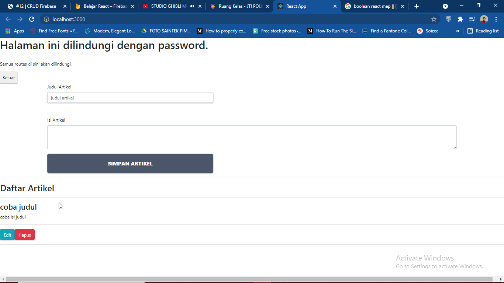

# 12 - CRUD Firebase

## Tujuan Pembelajaran

1. Mampu memahami konsep tentang CRUD firebase
2. Mampu mengimplementasikan CRUD ke dalam project firebase

## Hasil Praktikum

1. Praktikum 1 (Konfigurasi Database Firebase) :
    - Edit Firebase Config :
        
    
    
    - Edit Rules Firebase :
        
    

2. Praktikum 2 (Membuat Fungsi Create Artikel) :

    -  Create Artikel :

    

    -  Hasil Create :

    

    -  Database Realtime Data :

    

3. Praktikum 3 (Membuat Fungsi Hapus Artikel) :

    -  Kode Program :

    

    -  Menekan Tombol Hapus :

    

    -  Hasil Hapus Data :

        

4. Praktikum 4 (Membuat Fungsi Edit (Update) Artikel) :

    -  Menekan Tombol Edit :

    

    -  Hasil Edit Data :

        

### Tugas

**Soal :**

1. Berdasarkan praktikum 1 yang telah Anda lakukan, jelaskan perbedaan fungsi locked mode dan test mode pada langkah 3 saat Anda konfigurasi database Firebase?
2. Buatlah variabel userId pada praktikum 2 langkah 4 agar dapat menyimpan email dari user yang sedang login, sehingga dapat tersimpan di database!
3. Jelaskan maksud kode ini (dataArtikel || []) pada praktikum 2 langkah 6! Mengapa berbeda dari codelabs sebelumnya untuk menampilkan daftar artikel?
4. Lengkapilah kode pada praktikum 4 langkah 5 agar dapat melakukan update artikel! Mengapa setelah klik tombol Update Artikel, form Modal tidak hilang? Bagaimana Anda mengatasi hal tersebut?
5. Ketika Anda menekan tombol Edit, lalu menekan tombol Batal pada form Modal update artikel. Kemudian coba tambah artikel baru, maka artikel yang tadi kita klik tombol Edit akan berubah jadi data yang artikel baru ditambahkan. Mengapa demikian? Silakan diperbaiki.

**Jawaban :**
1. Perbedaan dari fungsi locked mode dan test mode adalah pada penulisan dan pembacaan data. Ketika masuk locked mode, maka data tidak akan bisa diakses maupun diolah karena pada pengaturannya diatur `false` dan sebaliknya pada test mode, data bisa diakses dan diolah.
2. Isi pada userId diubah menjadi `firebase.auth().currentUser.email`
- Kode Program yang diedit :

- Hasil :

3. Perintah tersebut berfungsi untuk menampilkan map data dalam bentuk array maupun object. Pada codelabs sebelumnya tidak seperti itu karena data yang diambil hanya berbentuk object.
4. Karena showEdit tidak diubah menjadi false lagi, sehingga modal tidak menghilang

Perbaikan :

5. Karena pada onSubmit form modal memanggil fungsi `handleTombolSimpan`, sehingga data baru yang akan tersimpan.

Perbaikan :