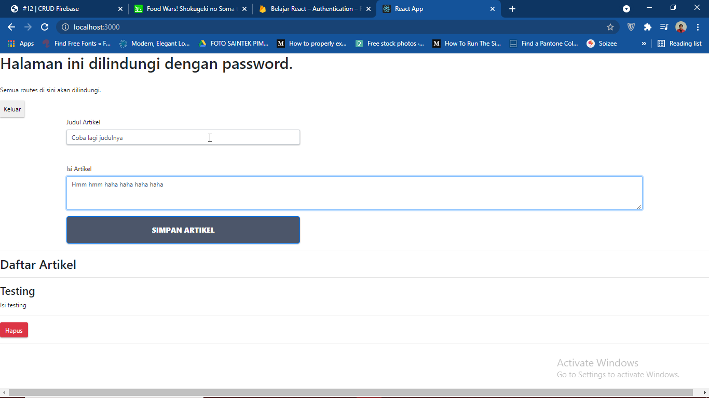

# 12 - CRUD Firebase

## Tujuan Pembelajaran

1. Mampu memahami konsep tentang CRUD firebase
2. Mampu mengimplementasikan CRUD ke dalam project firebase

## Hasil Praktikum

1. Praktikum 1 (Konfigurasi Database Firebase) :
    - Edit Firebase Config :
        
    
    
    - Edit Rules Firebase :
        
    

2. Praktikum 2 (Membuat Fungsi Create Artikel) :

    -  Create Artikel :

    

    -  Hasil Create :

    

    -  Database Realtime Data :

    

3. Praktikum 3 (Membuat Fungsi Hapus Artikel) :

    -  Kode Program :

    

    -  Menekan Tombol Hapus :

    

    -  Hasil Hapus Data :

        

