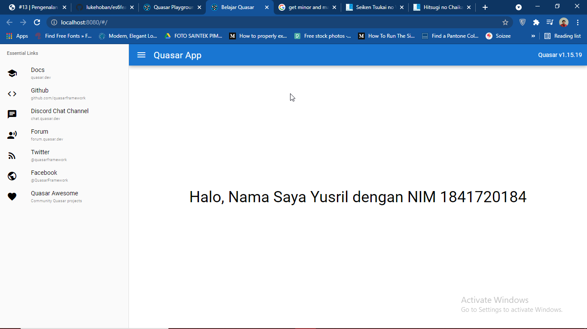

# 13 - Quasar Framework

## Tujuan Pembelajaran

1. Mampu memahami penggunaan Quasar
2. Mampu menerapkan Quasar pada project
3. Mampu memahami dokumentasi dari Quasar

## Hasil Praktikum

Praktikum 2 :

## Tugas

**Soal**
1. Berdasarkan praktikum 1 yang telah Anda lakukan, jelaskan kegunaan file quasar.conf.js ?

**Jawaban**
1. Berfungsi untuk mengatur konfigurasi dari project, seperti port yang akan digunakan, font, css, serta pengaturan *progressive web app*. Selain itu ada banyak lagi yang bisa diatur di dalam file tersebut.