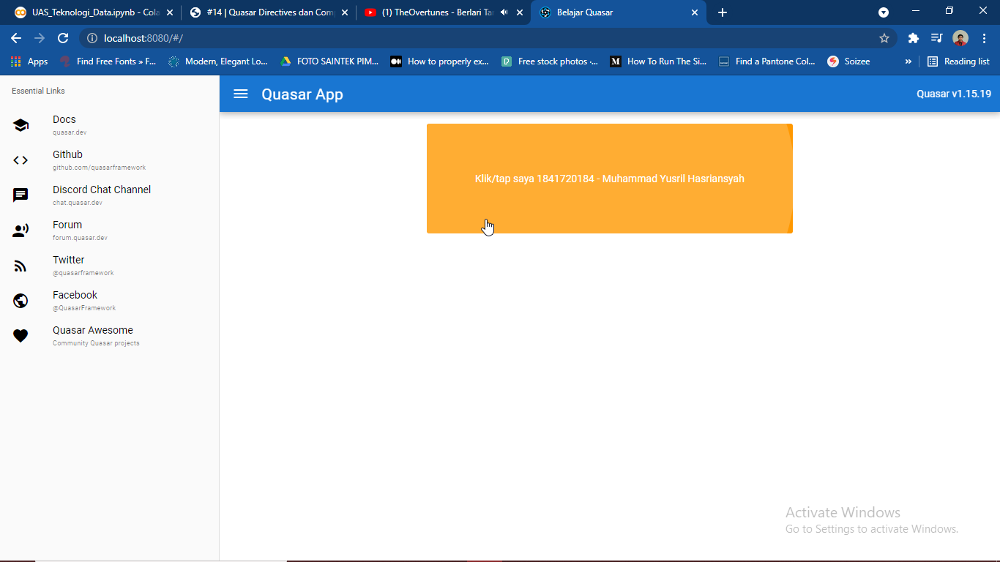
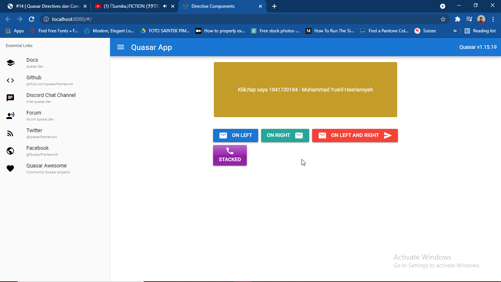
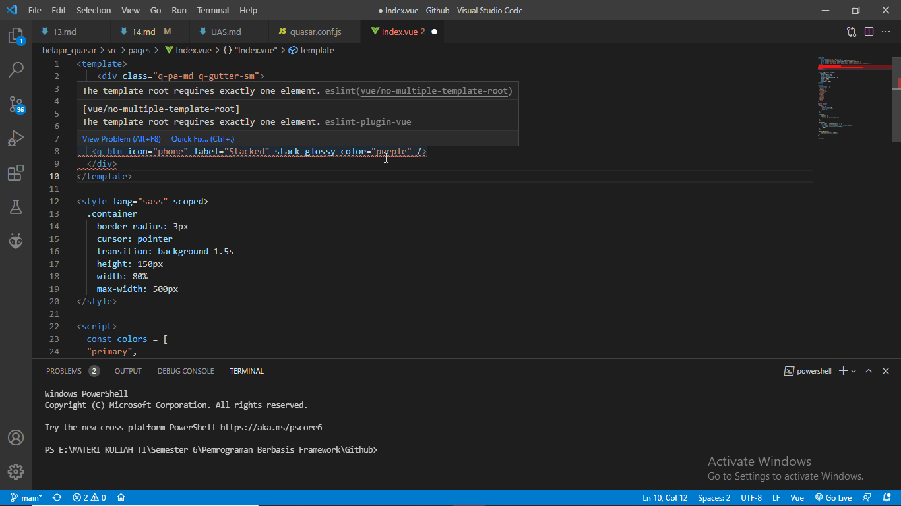

# 14 - Quasar Directive Components

## Tujuan Pembelajaran

1. Mampu memahami Directive Components dalam Quasar Framework
2. Mampu menerapkan Directive Components dalam Quasar Framework pada project

## Hasil Praktikum

- Praktikum 1 :



- Praktikum 2 :



## Tugas

### Soal
1. Berdasarkan praktikum 1 yang telah Anda lakukan, jelaskan maksud kode di template: `class="q-pa-md row justify-center"` ?

2. Berdasarkan praktikum 1 pada langkah nomor 4, jelaskan maksud script tersebut seperti kegunaan konstanta colors, fungsi data(), computed, mounted, dan beforeDestroy() !

3. Berdasarkan praktikum 2 pada langkah nomor 2, jelaskan maksud tiap kode HTML pada template yang mendefinisikan tiap button tersebut!

4. Coba ganti kode template HTML pada praktikum 2 menjadi seperti berikut. Save file, lalu perhatikan apa yang terjadi ? Mengapa terjadi demikian, jelaskan!
```
<template>
    <div class="q-pa-md q-gutter-sm">
        <q-btn color="primary" icon="mail" label="On Left" />
        <q-btn color="secondary" icon-right="mail" label="On Right" />
        <q-btn color="red" icon="mail" icon-right="send" label="On Left and Right" />
    </div>
    <div class="q-pa-md q-gutter-sm">
        <q-btn icon="phone" label="Stacked" stack glossy color="purple" />
    </div>
</template>
```

### Jawaban

1. kode program tersebut berfungsi untuk membuat baris dan membuat baris tersebut berada di posisi center secara horizontal

2. 
    - `colors` berfungsi untuk menampung warna yang akan digunakan.
    - `data()` berfungsi untuk inisialisasi pemanggilan warna dan index pada posisi pertama (0).
    - `computed` berfungsi untuk mengembalikan fungsi classes yang nantinya akan digunakan pada class v-ripple.
    - `mounted` berfungsi untuk mengubah warna dan index berdasarkan interval selama 3 detik.
    - `beforeDestroy()` berfungsi untuk menghilangkan interval atau efek perubahan warna dalam jangka waktu 3 detik tersebut.

3. 
    - `<div class="q-pa-md row justify-center">` berfungsi untuk membuat baris dan meletakkan posisinya pada posisi tengah secara horizontal.
    - `<div class="q-pa-md q-gutter-sm">` berfungsi untuk memberikan jarak antar button sebesar "sm" dan padding antara kata dengan button sebesar "md".
    - `<q-btn color="primary" icon="mail" label="On Left" />` berfungsi membuat button berwarna biru, memiliki icon mail/surat dan bertuliskan "On Left".
    - `<q-btn color="secondary" icon-right="mail" label="On Right" />` berfungsi untuk membuat button berwarna abu-abu dengan icon mail dan berisi tulisan "On Right".
    - `<q-btn color="red" icon="mail" icon-right="send" label="On Left and Right" />` berfungsi untuk membuat button berwarna merah dengan icon mail dan berisi tulisan "On Left and On Right".
    - `<br/>` berfungsi untuk membuat baris baru
    - `<q-btn icon="phone" label="Stacked" stack glossy color="purple"/>` berfungsi untuk membuat button berwarna ungu bergradasi seperti berkilau, memiliki icon telepon dan berisi tulisan "Stacked".

4. Ketika diganti dengan kode program tersebut maka akan muncul error, karena pada template tidak boleh ada 2 div sekaligus, seharusnya 2 div tersebut harus dibungkus 1 div agar menjadi 1 kesatuan.
Screenshot :
